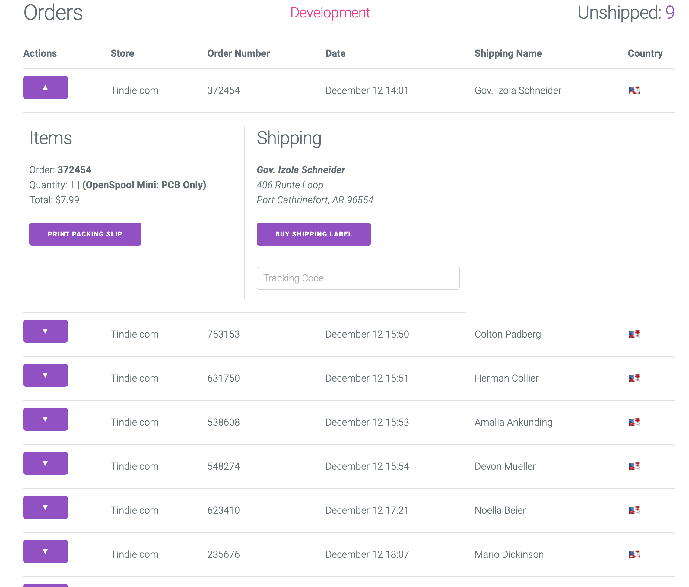

<p align=center>
    
</p>


# PackPoint

The shipping station software for Tindie / Easy Post


## Usage

Create a `.env` file with your settings. You can use the provided examples. 

`cp .env.sample .env`


Then start the server
`rackup`

localhost:9292

## Development
```
APP_ENV=development rackup
```


## Production
```
APP_ENV=production rackup
```

## Example
This example uses Faker to generate dummy addresses and usernames. 

