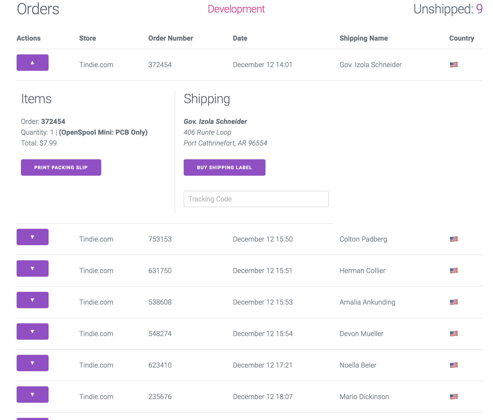

<p align=center>
    
</p>


# PackPoint

The shipping station software for Tindie / Easy Post


## Usage

Create a `.env` file with your settings. You can use the provided examples. 

`cp .env.sample .env`

Stripe support is optional and can pull orders from multiple Stripe stores/accounts at once - add a
`STRIPE_STORE_<id>_NAME` / `STRIPE_STORE_<id>_SECRET_KEY` / `STRIPE_STORE_<id>_EASYPOST_FROM_ADDRESS` trio per
store (see `.env.sample`). Orders are matched to Stripe Checkout Sessions that have collected a shipping
address; "shipped" status, tracking code, and label URL are written back to Stripe as metadata on the
PaymentIntent when you buy a label, so fulfillment state lives in Stripe rather than only in this app's session.

Each store ships from its own return address: Tindie orders use `TINDIE_EASYPOST_FROM_ADDRESS`, and each Stripe
store uses its own `STRIPE_STORE_<id>_EASYPOST_FROM_ADDRESS`. Both are EasyPost address IDs (`adr_...`) for
addresses already saved in your EasyPost account.

Then start the server
`rackup`

localhost:9292

## Development
```
APP_ENV=development rackup
```


## Production
```
APP_ENV=production RACK_ENV=production bundle exec rackup --host 0.0.0.0
```

## Production Docker/Podman

```bash
podman build -t spuder/packpoint . 
podman run  --env-file .env -e APP_ENV=production -e RACK_ENV=production -p 9292:9292 localhost/spuder/packpoint:latest
```

## Example
This example uses Faker to generate dummy addresses and usernames. 

